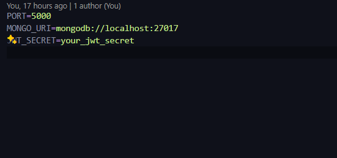

# Xclore Assignment
## Build a Admin Panel 
### Steps to install
1) git clone the repository.
2) use npm install in both backend and frontend .
3) Create a .env.local file in backend directory having -
. PORT number
. mongodb url
. JWT_secret 
Example includes 

4) run nodemon index.js in backend directory.
5) run npm run dev in frontend directory. 